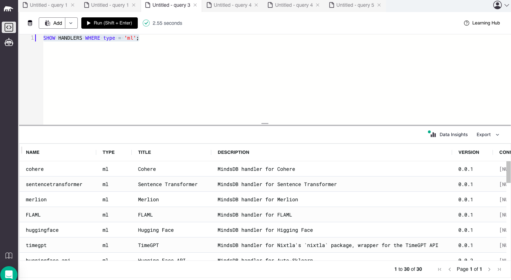
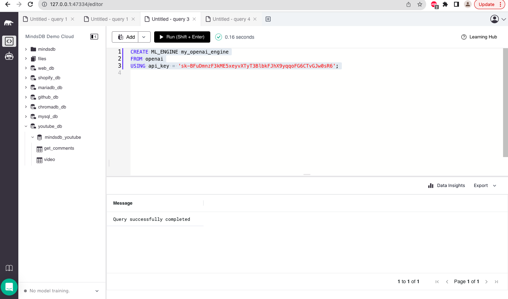
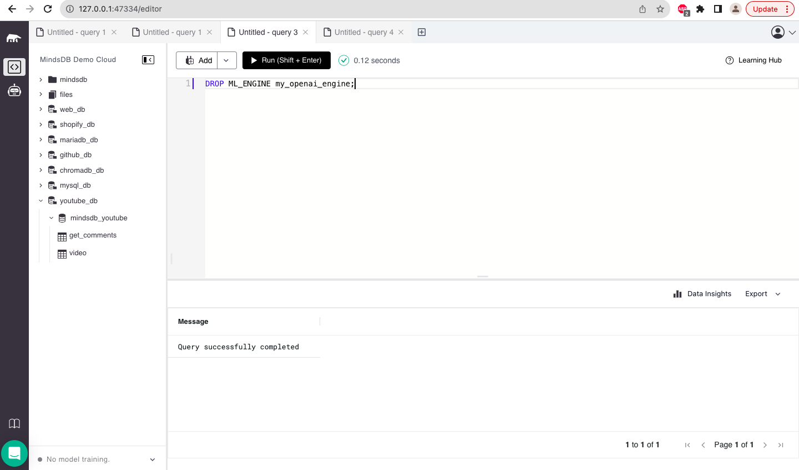
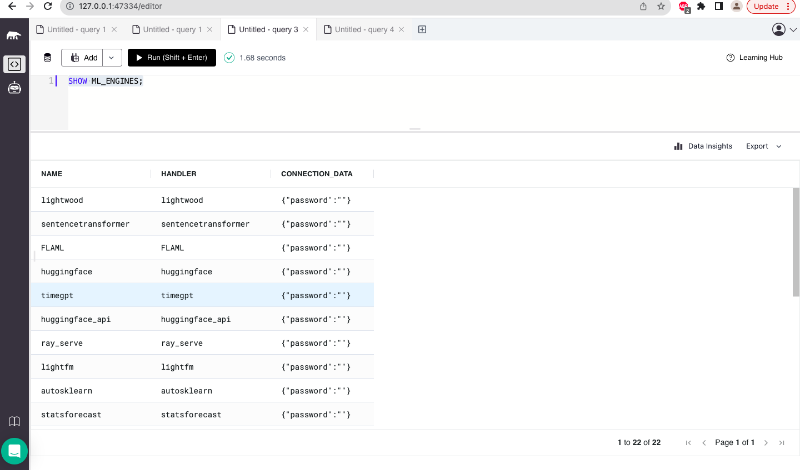

[Docs Testing] Test all available commands from "AI Workflow -> Create AI Engines" section using SQL

https://github.com/mindsdb/mindsdb/issues/7563

Test 1 - Test the list ml engine handlers

Link - https://docs.mindsdb.com/sql/list-ml-handlers

----- 
Test 2 - Test create ml engine command

Link - https://docs.mindsdb.com/sql/create/ml-engine

----- 
Test 3 - Test the drop ml engine command

Link - https://docs.mindsdb.com/sql/drop/ml-engine

----- 
Test 4 - Test the show ml engines command

Link - https://docs.mindsdb.com/sql/show-ml-engines

### Result: All the test cases are working fine.