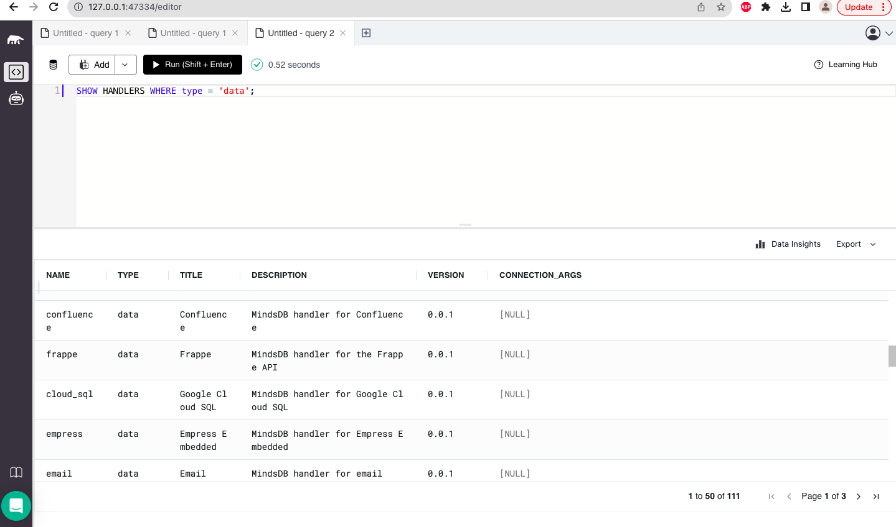
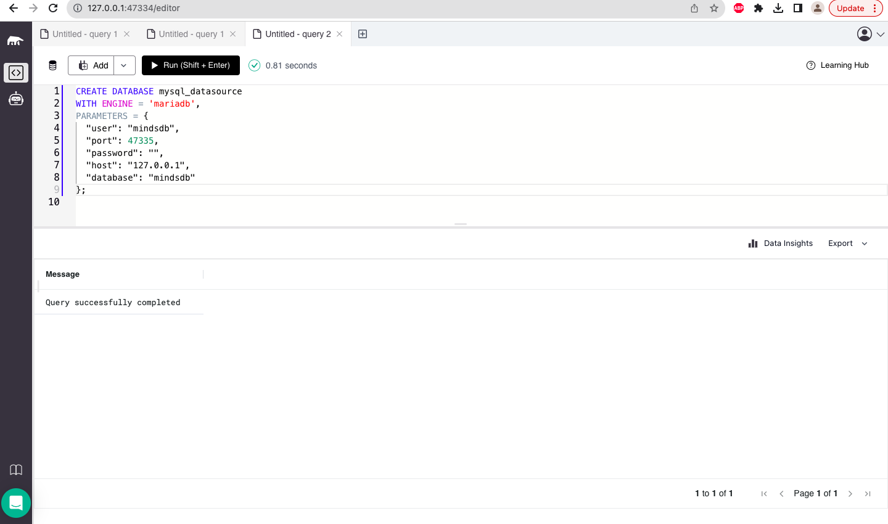
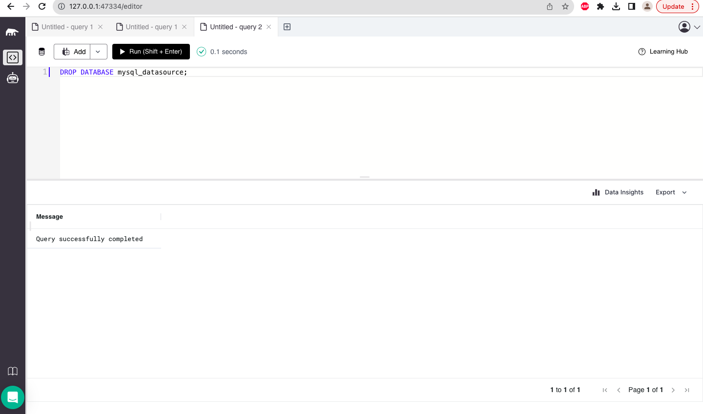
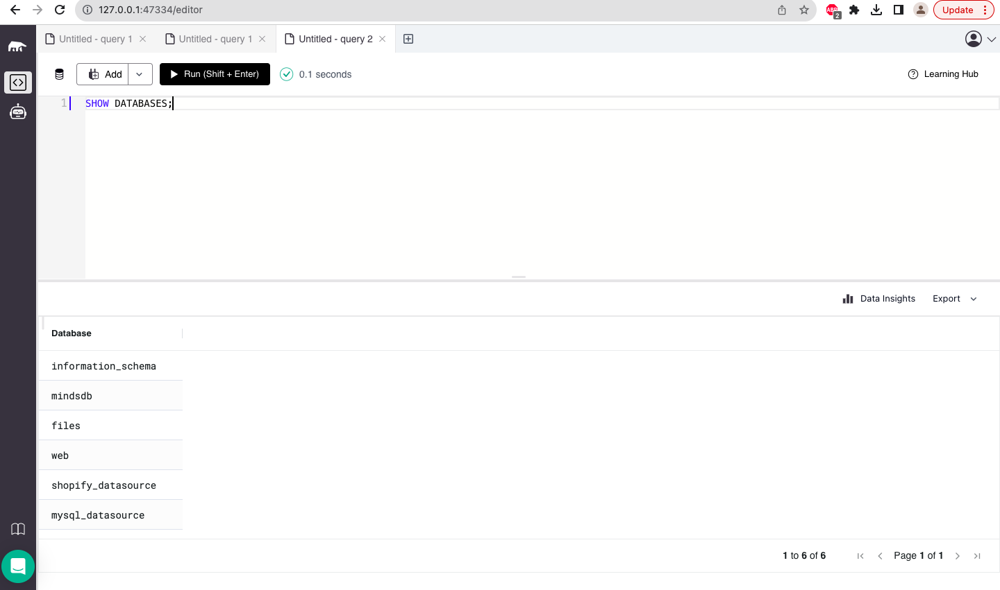
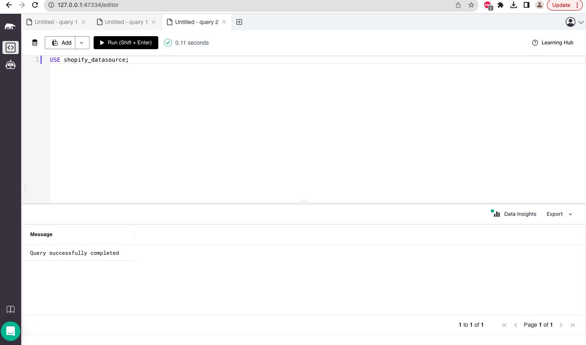
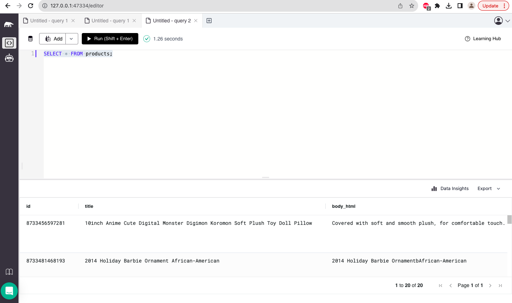

[Docs Testing] Test all available commands from "AI Workflow -> Integrate Data Sources" section using SQL

https://github.com/mindsdb/mindsdb/issues/7514

Test 1 - Test the list data handlers

Link - https://docs.mindsdb.com/sql/list-data-handlers

----- 
Test 2 - Test create database command

Link - https://docs.mindsdb.com/sql/create/database

----- 
Test 3 - Test the drop database command

Link - https://docs.mindsdb.com/sql/drop/database

----- 
Test 4 - Test the show database command

Link - https://docs.mindsdb.com/sql/show-databases

----- 
Test 5 - Test the use database command

Link - https://docs.mindsdb.com/sql/api/use

----- 
Test 6 - Test the select from table after use database command

Link - https://docs.mindsdb.com/sql/api/use

### Result: All the test cases are working fine.